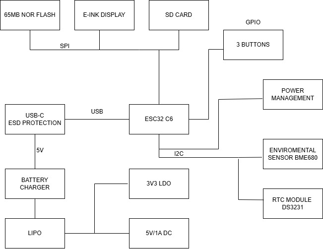

# TSC
### Iarina-Ioana Popa, 332CA

# OpenBook eBook Reader – Hardware Overview
Acest proiect de eBook Reader utilizeaza microcontrollerul *ESP32-C6*, fiind proiectat pentru consum redus de energie, conectivitate avansata si adaptabilitate hardware.

## Diagrama Block

## Microcontroller – ESP32-C6
- *Arhitectura:* RISC-V 32-bit
- *Conectivitate:* WiFi 6, Bluetooth 5.0 LE
- *Interfete disponibile:* SPI, I2C, UART, PWM, GPIO
- *Eficienta energetica:* moduri deep sleep implementate

## Display E-Paper
- *Conectivitate:* Header de 20 pini dedicat
- *Protocol:* SPI + GPIO
 - Semnale principale: EPD_CS, EPD_DC, EPD_RST, EPD_BUSY, etc.
- *Beneficii:* zero consum in stare inactiva, vizibilitate superioara la lumina naturala

## Ceas Timp Real – DS3231SN
- *Caracteristici:* Precizie ridicata (±2 ppm)
- *Protocol:* I2C (partajat pe SDA/SCL)
- *Alimentare secundara:* Supercapacitor

## Senzor Ambiental – BME688
- *Masuratori:* Temperatura, Umiditate, Presiune atmosferica, VOCs
- *Interfata:* I2C
 - SDA: IO1
 - SCL: IO2
- *Alimentare:* 3.3V
- *Adresa I2C:* 0x76

## Sistem de Alimentare
### MAX17048 – Monitor Baterie
- *Rol:* Masurare capacitate baterie LiPo
- *Protocol:* I2C (IO1, IO2)
### MCP73831 – Controller Incarcare
- *Functionalitate:* Incarcare baterie LiPo (USB la 3.7V)
- *Capacitate:* ~500 mA
- *Indicator:* LED status incarcare
### XC6204 – Regulator LDO
- *Tensiune intrare:* 5V (USB)
- *Tensiune iesire:* 3.3V
- *Capacitate curent:* 200 mA
- *Eficienta energetica:* < 1 µA in standby

## Memorie si Stocare
### Card microSD
- *Protocol:* SPI (IO4–IO9)
- *Utilizare:* Stocare eBooks, setari
### Memorie Flash – W25Q512JV (64MB)
- *Protocol:* SPI (pini dedicati: IO20–IO23)
- *Utilizare:* Stocare firmware, fonturi, resurse

## Supervisor Tensiune & Resetare
- *Component:* BD52xx
- *Rol:* Monitorizare tensiune si resetare sigura
- *Pin control:* IO0

## Extensie I2C – Qwiic / Stemma QT
- *Conector:* 4 pini (3V3, GND, SDA, SCL)
- *Protocol:* I2C (IO1, IO2)
- *Ecosistem:* Compatibil cu module Adafruit / SparkFun

## Profil Consum Energetic
| Componenta             | Mod Activ       | Mod Standby    |
|------------------------|-----------------|----------------|
| ESP32-C6               | 80–150 mA       | <10 µA         |
| E-Paper                | 20–30 mA        | 0 µA           |
| BME688                 | 1.1 mA          | 0.15 µA        |
| RTC DS3231SN           | 200 µA          | 2 µA           |
| SD Card                | 20–100 mA       | 0.2 µA         |
| MAX17048               | 50 µA           | 1 µA           |
| NOR Flash              | 20 mA           | 5 µA           |

## Mapare Pini – ESP32-C6
| Functionalitate        | Pini GPIO            |
|------------------------|----------------------|
| Card SD (SPI)          | IO4, IO5, IO6, IO9   |
| Display E-Paper        | IO10–IO19            |
| I2C (RTC, Senzor)      | IO1 (SDA), IO2 (SCL) |
| Flash SPI extern       | IO20–IO23            |
| Buton Reset / Boot     | IO0                  |

## BOM (Bill Of Materials)
| Componenta | Link Cumpărare | Datasheet |
|------------|-----------------|-----------|
| Condensatoare Tantalum | [Buy](https://ro.mouser.com/ProductDetail/KYOCERA-AVX/TAJW107M010RNJ?qs=Wtp%252Bf%2FAeVqIH8v1VxV%252B1Rg%3D%3D) | [Datasheet](https://ro.mouser.com/datasheet/2/40/TAJ-3165264.pdf) |
| Rezistente R0402 | [Buy](https://store.comet.srl.ro/Search/?keywords=r0402#eyJpcHAiOiIyMCIsIm0iOiIiLCJrIjoicjA0MDIifQ%3D%3D) | [Datasheet](https://www.yageo.com/upload/media/product/products/datasheet/rchip/PYu-RC_Group_51_RoHS_L_12.pdf) |
| Condensatoare C0402 | [Buy](https://store.comet.srl.ro/CatalogueFarnell/Search/?keywords=c0402#eyJpcHAiOiIyMCIsImsiOiJjMDQwMiJ9) | [Datasheet](https://componentsearchengine.com/Datasheets/2/CC0402MRX5R5BB106.pdf) |
| 112A-TAAR-R03 | [Buy](https://store.comet.srl.ro/Catalogue/Product/43497/) | [Datasheet](https://www.snapeda.com/parts/112A-TAAR-R03/Attend/datasheet/) |
| SD0805S020S1R0 | [Buy](https://ro.mouser.com/ProductDetail/KYOCERA-AVX/SD0805S020S1R0?qs=jCA%252BPfw4LHbpkAoSnwrdjw%3D%3D) | [Datasheet](https://ro.mouser.com/datasheet/2/40/schottky-3165252.pdf) |
| MBR0530 | [Buy](https://ro.mouser.com/ProductDetail/onsemi-Fairchild/MBR0530?qs=VOMQJJE%252BBNniwJKcE3T43Q==) | [Datasheet](https://ro.mouser.com/datasheet/2/308/MBR0530_D-1810985.pdf) |
| CHG_LED | [Buy](https://ro.mouser.com/ProductDetail/Kingbright/KP-1608SURCK?qs=2JU0tDl2GZ3FuyEWfBV1%2Fg==) | [Datasheet](https://www.snapeda.com/parts/KP-1608SURCK/Kingbright/datasheet/) |
| PGB1010603MR | [Buy](https://www.digikey.com/en/products/detail/littelfuse-inc/PGB1010603MR/715755) | [Datasheet](https://www.littelfuse.com/assetdocs/pulseguard-esd-suppressors-pgb1-datasheet?assetguid=8a337998-d54d-466b-be4e-dc5bcd1f9321) |
| ESP32-C6-WROOM-1-N8 | [Buy](https://ro.mouser.com/ProductDetail/Espressif-Systems/ESP32-C6-WROOM-1-N8?qs=8Wlm6%252BaMh8ST02Gmwp74cw%3D%3D) | [Datasheet](https://ro.mouser.com/datasheet/2/891/Espressif_ESP32_C6_WROOM_1__Datasheet_V0_1_PRELIMI-3239987.pdf) |
| DS3231SN | [Buy](https://store.comet.srl.ro/Catalogue/Product/47690/) | [Datasheet](https://ro.mouser.com/datasheet/2/609/DS3231-3421123.pdf) |
| BME680 | [Buy](https://ro.mouser.com/ProductDetail/Bosch-Sensortec/BME688?qs=IS%252B4QmGtzzqQoVDscqwx3A%3D%3D) | [Datasheet](https://ro.mouser.com/datasheet/2/783/bst_bme688_fl000-2307034.pdf) |
| USBLC6-2SC6Y | [Buy](https://ro.mouser.com/ProductDetail/STMicroelectronics/USBLC6-2SC6Y?qs=gNDSiZmRJS%2FOgDexvXkdow%3D%3D) | [Datasheet](https://ro.mouser.com/datasheet/2/389/usblc6_2sc6y-1852505.pdf) 
| MAX17048 | [Buy](https://ro.mouser.com/ProductDetail/Analog-Devices-Maxim-Integrated/MAX17048G%2bT10?qs=D7PJwyCwLAoGnnn8jEPRBQ%3D%3D) | [Datasheet](https://ro.mouser.com/datasheet/2/609/MAX17048_MAX17049-3469099.pdf) |
| MCP73831 | [Buy](https://ro.mouser.com/ProductDetail/Microchip-Technology/MCP73831T-2ATI-OT?qs=yUQqVecv4qsZbioEUu%252B83g%3D%3D) | [Datasheet](https://ro.mouser.com/datasheet/2/268/MCP73831_Family_Data_Sheet_DS20001984H-3441711.pdf) |
| BD5229G-TR | [Buy](https://www.digikey.com/en/products/detail/rohm-semiconductor/BD5229G-TR/3663792) | [Datasheet](https://fscdn.rohm.com/en/products/databook/datasheet/ic/power/voltage_detector/bd52xxg-e.pdf) |
| W25Q512JVEIQ | [Buy](https://ro.mouser.com/ProductDetail/Winbond/W25Q512JVEIQ?qs=l7cgNqFNU1jw6svr3at6tA%3D%3D) | [Datasheet](https://ro.mouser.com/datasheet/2/949/Winbond_W25Q512JV_Datasheet-3240039.pdf) |
| XC6220A331MR-G | [Buy](https://ro.mouser.com/ProductDetail/Torex-Semiconductor/XC6220A331MR-G?qs=AsjdqWjXhJ8ZSWznL1J0gg%3D%3D) | [Datasheet](https://ro.mouser.com/datasheet/2/760/xc6220-3371556.pdf) |
| USB4110-GF-A | [Buy](https://ro.mouser.com/ProductDetail/GCT/USB4110-GF-A?qs=KUoIvG%2F9IlYiZvIXQjyJeA%3D%3D) | [Datasheet](https://ro.mouser.com/datasheet/2/837/GCT_USB4110_Product_Drawing___20k_cycles-3455479.pdf) |
| FH34SRJ | [Buy](https://ro.mouser.com/ProductDetail/Hirose-Connector/FH34SRJ-24S-0.5SH99?qs=vcbW%252B4%252BSTIpKBl5ap9J8Fw%3D%3D) | [Datasheet](https://ro.mouser.com/datasheet/2/185/FH34SRJ_24S_0_5SH_99__CL0580_1255_6_99_2DDrawing_0-1615044.pdf) |
| Si1308EDL-T1-GE3 | [Buy](https://www.digikey.com/en/products/detail/vishay-siliconix/SI1308EDL-T1-GE3/4876435) | [Datasheet](https://www.vishay.com/docs/63399/si1308edl.pdf) |
| PFMF.050.1 | [Buy](https://ro.mouser.com/ProductDetail/EPCOS-TDK/B72520T0350K062?qs=dEfas%2FXlABIszF52uu7vrg%3D%3D) | [Datasheet](https://www.tdk-electronics.tdk.com/inf/75/db/CTVS_14/Surge_protection_series.pdf) |
| DMG2305UX-7 | [Buy](https://www.digikey.com/en/products/detail/diodes-incorporated/DMG2305UX-7/4340666) | [Datasheet](https://www.diodes.com/assets/Datasheets/DMG2305UX.pdf) |
| SJ (Solder Jumpers) | [Buy](https://grabcad.com/library/solder-jumpers-1) | [Datasheet](https://grabcad.com/library/solder-jumpers-1) |
| Butoane | [Buy](https://industry.panasonic.com/global/en/products/control/switch/light-touch/number/evqpuj02k) | [Datasheet](https://industry.panasonic.com/global/en/downloads?tab=catalog&small_g_cd=203&part_no=EVQPUJ02K) |
| CPH3225A | [Buy](https://www.digikey.com/en/products/detail/seiko-instruments/CPH3225A/8692444) | [Datasheet](https://mm.digikey.com/Volume0/opasdata/d220001/medias/docus/6537/rev05-CPHCPM.pdf) |
| QWIIC_RIGHT_ANGLE | [Buy](https://ro.mouser.com/ProductDetail/SparkFun/PRT-14417?qs=wd5RIQLrsJhgdz%2FpmZ%2F3GQ==) | [Datasheet](https://ro.mouser.com/datasheet/2/813/Qwiic_Connector_Datasheet-1223982.pdf) |
| Bobine 744043680 | [Buy](https://ro.mouser.com/ProductDetail/Wurth-Elektronik/744043680?qs=PGXP4M47uW6VkZq%252BkzjrHA%3D%3D) | [Datasheet](https://www.we-online.com/components/products/datasheet/744043680.pdf) |

## Note aditionale
- Aproximativ 130 vias la PCB
- Placuta in format 3D prezinta o diferenta de cativa mm in zona de sud a acesteia
- TP-urile nu au putut fi plasate precum in schema initiala, pentru evitarea viasurilor acestea au fost plasate cat mai aproape fata de  componentele de care se legau in urma procesului de rutare
- Bobina a suferit modificari din cauza erorilor date de ERC
- U4 a suferit modificari la SMD hole
- Am deplasat putin la dreaota una dintre mufe pentru a alinia perfect USB-ul
